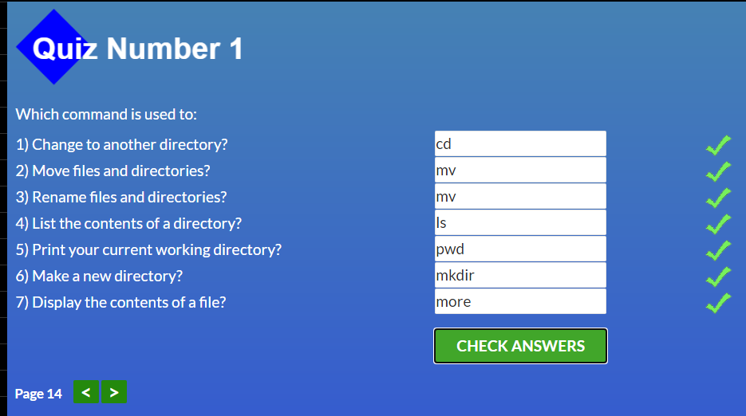
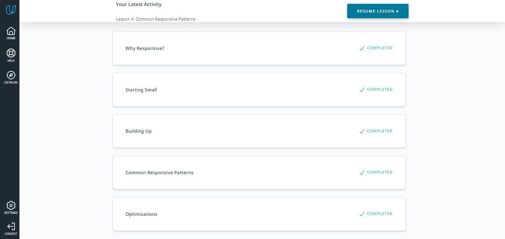

# ***Tasks of Frontend course 2021 by Kottans***

## **Stage 0. Self-Study**

## General
0. [X] [Git Basics](#git-basics)
1. [X] [Linux CLI & Networking](#Linux-CLI-and-Networking)
2. [X] [VCS GitHub & Collaboration](#VCS-GitHub-and-Collaboration)
		
## Front-End Basics
3. [X] [Intro to HTML & CSS](#Intro-to-HTML-and-CSS)
4. [X] [Responsive Web Design](#Responsive-Web-Design)
5. [X] [HTML & CSS - practice](#HTML-and-CSS-Practice)
6. [X] [JavaScript Basics](#JavaScript-Basics)
7. [X] [Document Object Model - practice](#Document-Object-Model-practice)

## Advanced Topics
8. [X] [Building a Tiny JS World (pre-OOP) - practice](#Building-a-Tiny-JS-World-practice)
9. [X] [Object oriented JS - practice](#Object-oriented-JS-practice)
10. [X] [OOP exercise - practice](#OOP-exercise-practice)
11. [ ] [Offline Web Applications](#Offline-Web-Applications)
12. [ ] [Memory pair game - real project!](#Memory-pair-game)
13. [ ] [Website Performance Optimization](#Website-Performance-Optimization)
14. [ ] [Friends App - real project!](#Friends-App)

---
---
# **Contents**

### ***Git Basics***
---

   	
Proofs

**what was new:** 
GIT is absolutely new thing for me. And I'm going to learn it deeply.  Also I gave known about Markdown language.

**what surprised:**  
There is an all-purpose control version system. I used to think that a the system like a git exist separately for each programming language in their IDE. 
And yes! I have made my first pull request!

**what can be used in future:**  
Will use GIT and Markdown language.
Have learnt and will use following commands: git init, git clone, git status, git log, git add, git commit, git diff, git tag, git branch, git checkout, git merge, git push, etc.

### ***Linux CLI and Networking***
---

   	
Proofs

   	

**what was new:**  
I haven't used Linux before! All commands are new for me! But it is not shocked me, because similar functional is used in Windows.

**what surprised:**  
It was very interesting to learn about how the HTTP protocol works.

**what can be used in future:**  
I will have some experience, if I face with Linux. I also plan to get acquainted with the work of HTTP and other protocols more closely. For this I plan to 
use articles on Habr + a video course on the basics of networks -- https: //www.asozykin.ru/courses/networks_online.
Got acquainted with the standard Linux's commands and the basics of HTTP and protocol.

### ***VCS GitHub and Collaboration***
---

   	
Proofs

**what was new:** 
I have known how to work with forks.

**what surprised:** 
I was surprised how easy the pull request is and how useful it is.

**what can be used in future:**  
I will use forks, pull-requests, rebazing, etc.

I learned how to work with other developers in a GIT project. Why do we need forks and how do they work. Understood the git pull and git push commands.

### ***Intro to HTML and CSS***
---

   	
Proofs

**what was new:**
Flexboxes, GRID, transition.

**what surprised:**  
It is not so difficult to create a menu due to flexboxes. Grid gives us great opportunity to convenient positioning of elements. Semantic html tags allow us to do code more expressive. 

**what can be used in future:**
Will use flexboxes, grids, transition and semantic tags.

### ***Responsive Web Design***
---

   	
Proofs

**what was new:**
All was new for me, because I haven't dealt with Responsive Web Design.

**what surprised me:**
I know about  Responsive Web Design, but I haven't studied it before.
I liked flexboxfroggy game!

**what I'm going to use in future:**
media queries, flexbox css properties and relative sizes.

### ***HTML and CSS Practice***
---
HTML and CSS Practice—#done

[Demo](https://lgeorge007.github.io/hooli-style-popup/).
[Code base](https://github.com/LGeorge007/hooli-style-popup).

In general, the task is not difficult but interesting. I did it first using id as I found on the Internet.
After I reviewed the video for this task, and I realized how to stylize checkboxes. Also saw the use of summary and details tags in practice.
I learned that you can write 2 pseudo-classes in the same CSS class. Studied the types of selectors.

**what was new:**
styling checkboxes, appearance property, pseudoclasses focus, checked, using keybords to cite navigation.

**what surprised me:**
It was interesting to study the styling of checkboxes.

**what I'm going to use in future:**
styling checkboxes, appearance property, using pseudoclasses for creating condition in CSS.

### ***JavaScript Basics***
---

   	
Proofs

It was very interesting and very useful chapter for me. 

**what was new:**
Any loops can be replaced with recursion.
Deference between local and global scope.
New features that was added with ES6 standard: like desturcturing, template strings, etc. 
I've known about hoisting, difference between let and var, and any interesting things.

**what surprised me:**
I was really surprised how developers use JS before ES6!
I can't imagine JS without ES6. But ES6 was approved only in 2015 year.
The chapter with algorithms was an interesting puzzle. It was a little bit difficult, but I liked it!

**what I'm going to use in future:**
All of this chapter. 
Most of all I liked the use of functions map, filter, reduce, sort, etc. 
Also arrow function, default pararmetrs, destructuring,  ternary operator.
I have learned all common function to work with arrays, strings, numbers and I will use they.

### ***Document Object Model practice***
---
Document Object Model practice—#done

   	
Proofs

[Demo](https://LGeorge007.github.io/DOM-practice/).
[Code base](https://github.com/LGeorge007/DOM-practice).

I liked this task very much. 

**what was new:**
I learned in practice a lot of new InnerHTML, insertAdjacentHTML, appendChild(), createElement(), addEventListener().
Template strings '$ {variable}'. Methods of array filter() and find(). Side menu and media screen.

**what surprised me:**
I didn't think that you can handle the entire rendering of the page using only JS.

**what I'm going to use in future:**
Everything new that I learned in this task.

### ***Building a Tiny JS World practice***
---
A Tiny JS World — #done

[Demo](https://LGeorge007.github.io/a-tiny-JS-world).
[Code base](https://github.com/LGeorge007/a-tiny-JS-world).

**what was new:**
Using destructuring in practice.
Didn't know that conditions can be used inside the array.

**what surprised me:**
Using an array to output complex strings.

**what I'm going to use in future:**
I will use an array to output complex strings. This entry is more readable and convenient.
I will use destructuring for objects.

### ***Object oriented JS practice***
---
Object oriented JS — #done

[Demo](https://lgeorge007.github.io/object-oriented-JS/)

   	
Proofs

**what was new:**
Using objects and prototypal inheritance for real objects.

**what surprised me:**
I really liked looking for a solution, what objects need to be created.

**what I'm going to use in future:**
objects and prototypal inheritance, destructuring.

### ***OOP exercise practice***
---
OOP exercise — #done

[Demo](https://LGeorge007.github.io/oop-practice)
[Code base](https://github.com/LGeorge007/oop-practice)

**what was new:**
Classes, inheritance from parent class, using super().
pattern array.ForEach(el => new SomeObject(el));

**what surprised me:**
Nothing surprised me. 
I liked prototypal inheritance more than Classes.

**what I'm going to use in future:**
Everything new that I learned in this task.

### ***Offline Web Applications***
---

### ***Memory pair game***
---

### ***Website Performance Optimization***
---

### ***Friends App***
---

